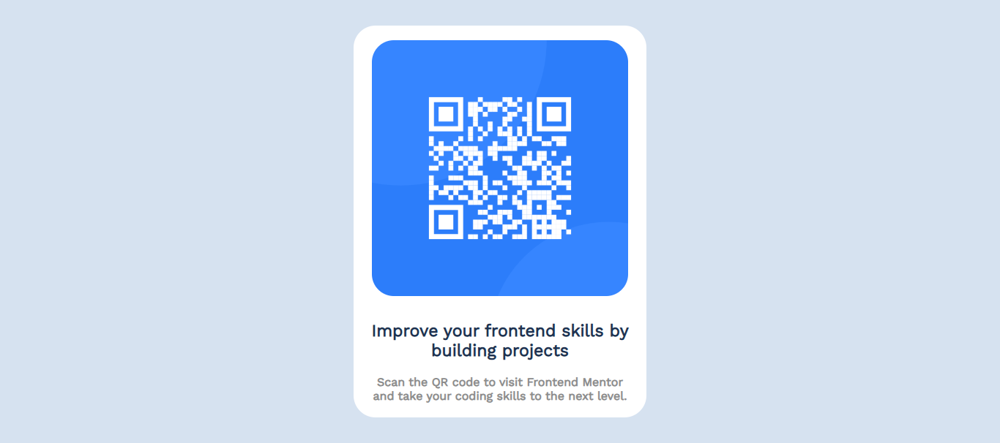

# Projeto-qr-code
Este é o projeto inicial para quem está começando no Frontend Mentor. Ele consiste em colocar um qrcode, um título e um parágrafo no meio da tela com alguma estilização.
Este foi o resultado alcançado:
- Para telas desktop:

- Para telas de celular:

